# 本项目 CDN 加速及安全防护由 Tencent EdgeOne 赞助

[官网链接：亚洲最佳CDN、边缘和安全解决方案 - Tencent EdgeOne](https://edgeone.ai/zh?from=github)


# kafka map

[English](./README.md) | 简体中文

为编程插上翅膀，给`kafka`装上导航。

## 简介

`kafka-map`是使用`Java17`和`React`开发的一款`kafka`可视化工具。

目前支持的功能有：

- 多集群管理
- 集群状态监控（分区数量、副本数量、存储大小、offset）
- 主题创建、删除、扩容（删除需配置delete.topic.enable = true）
- broker状态监控
- 消费者组查看、删除
- 重置offset
- 消息查询（支持String和json方式展示）
- 发送消息（支持向指定的topic和partition发送字符串消息）
- 延迟消息（通过扩展使kafka支持18个级别的延迟消息）

## 截图

### 添加集群

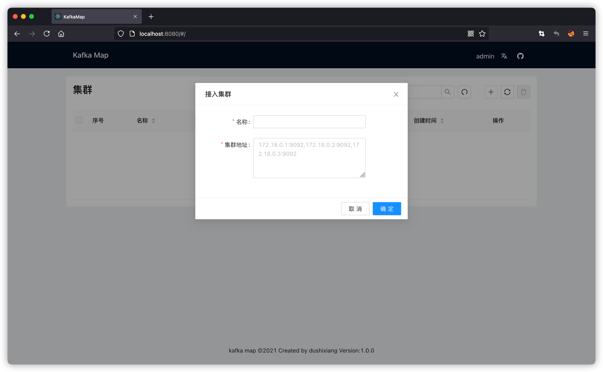

### 集群管理

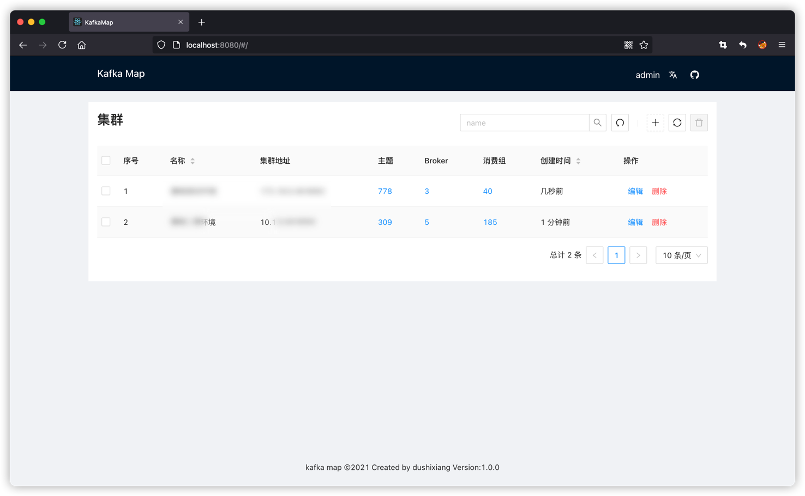

### broker

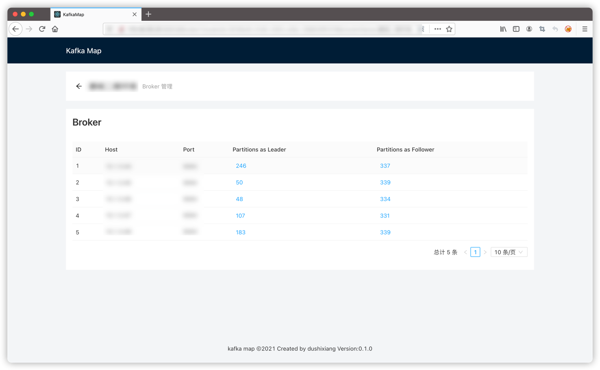

### 主题管理

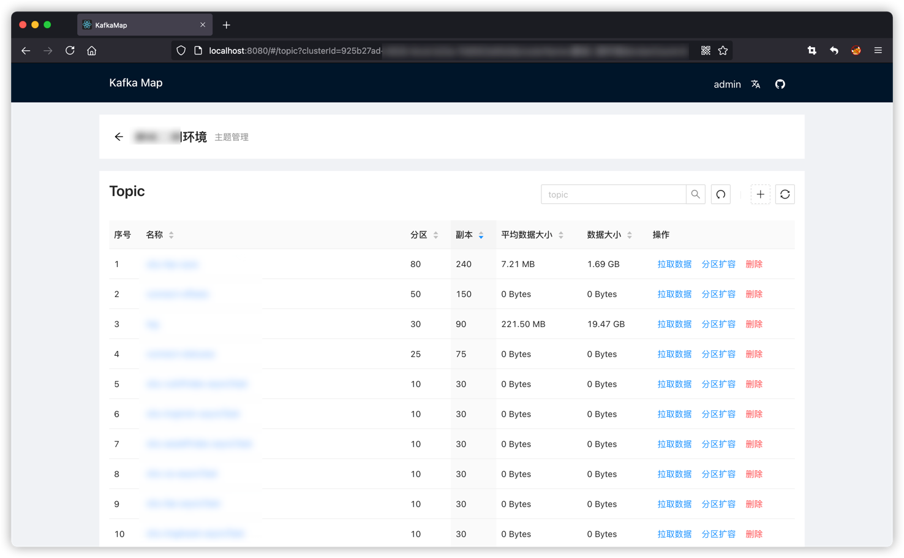

### 消费组

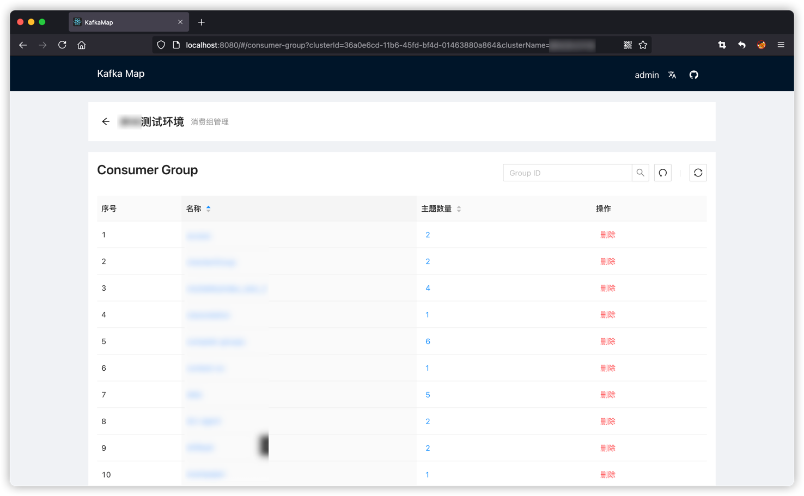

### 查看消费组已订阅主题

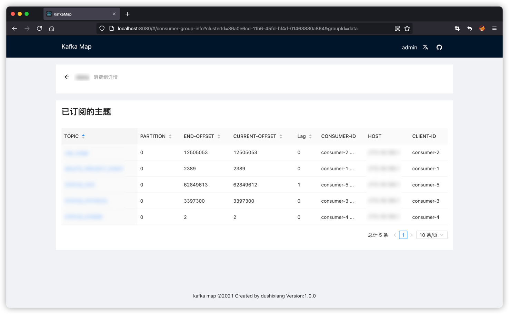

### topic详情——分区

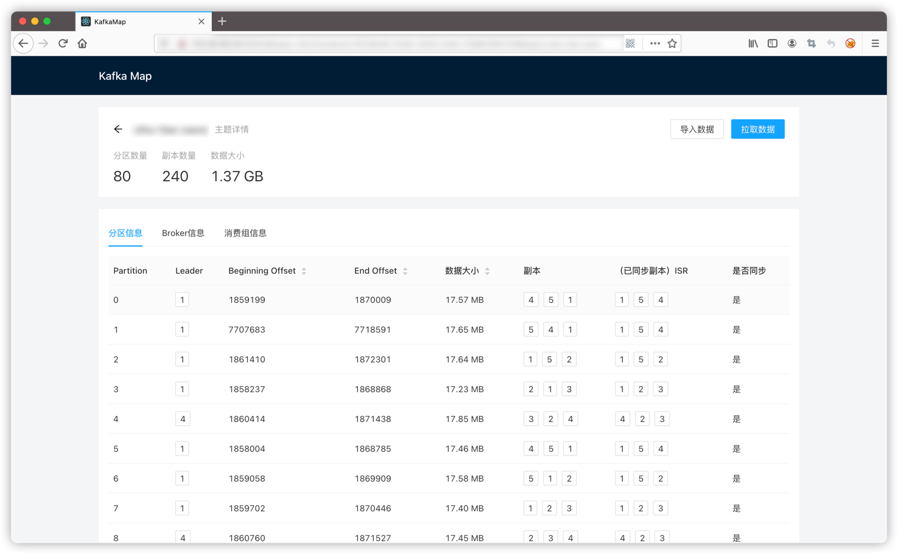

### topic详情——broker

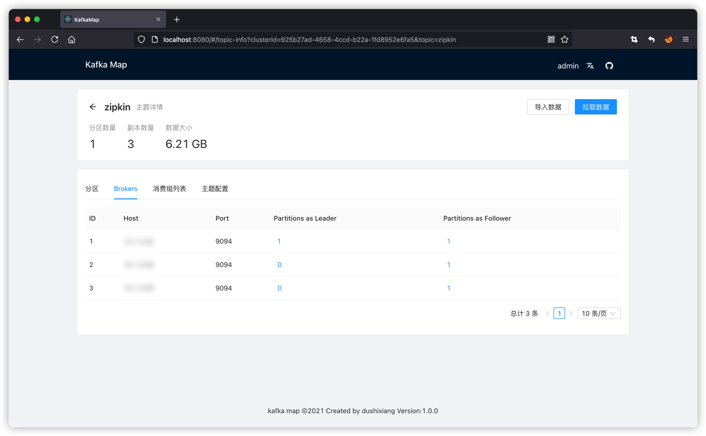

### topic详情——消费组

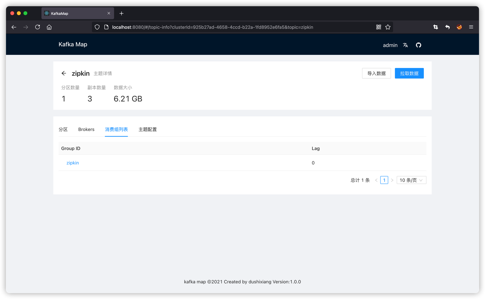

### topic详情——消费组重置offset


### topic详情——配置信息

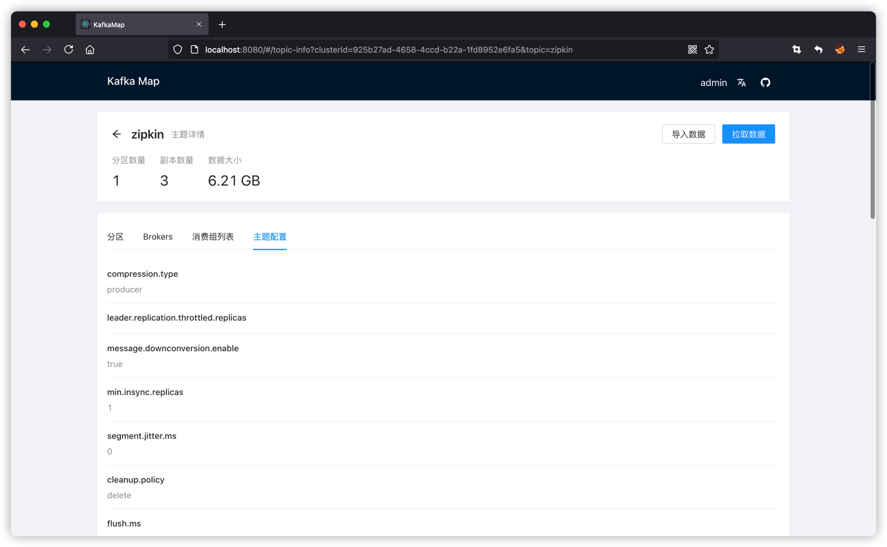

### 生产消息

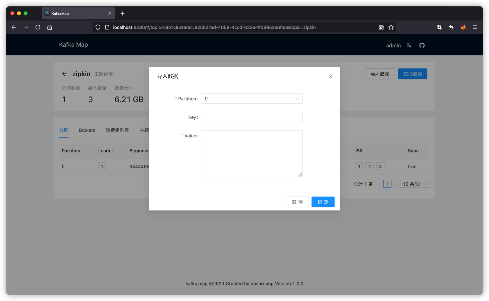

### 消费消息

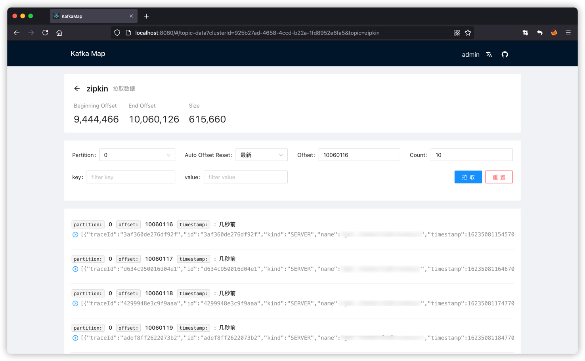

### 延迟消息

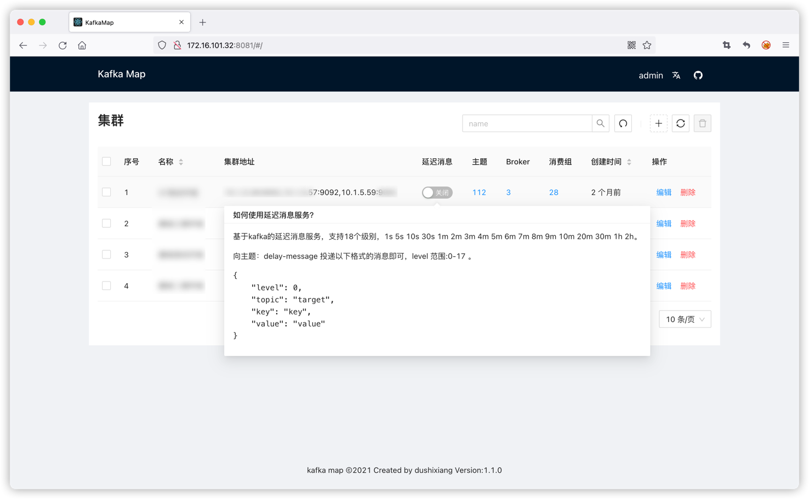

## 协议与条款

如您需要在企业网络中使用 `kafka-map` ，建议先征求 IT 管理员的同意。下载、使用或分发 `kafka-map` 前，您必须同意 [协议](./LICENSE) 条款与限制。本项目不提供任何担保，亦不承担任何责任。

## 依赖环境

- Java17 或更高版本
- Apache Kafka 1.1.0 或更高版本

## docker方式安装

环境变量

| 参数  | 含义  |
|---|---|
| DEFAULT_USERNAME |  初始登录账号 |
| DEFAULT_PASSWORD |  初始登录密码 |

```shell
docker run -d \
    -p 8080:8080 \
    -v /opt/kafka-map/data:/usr/local/kafka-map/data \
    -e DEFAULT_USERNAME=admin \
    -e DEFAULT_PASSWORD=admin \
    --name kafka-map \
    --restart always dushixiang/kafka-map:latest
```

## 原生方式安装

下载
```shell
wget https://github.com/dushixiang/kafka-map/releases/latest/download/kafka-map.tgz
```

解压
```shell
tar -zxvf kafka-map.tgz -C /usr/local/
```

### 前台运行
```shell
# kafka-map文件夹
cd /usr/local/kafka-map
# 根据需求自行修改配置
vi application.yml
# 启动
java -jar kafka-map.jar 
```

### 系统服务方式运行

```shell
cat <<EOF >> /etc/systemd/system/kafka-map.service
[Unit]
Description=kafka map service
After=network.target

[Service]
WorkingDirectory=/usr/local/kafka-map
ExecStart=/usr/bin/java -jar /usr/local/kafka-map/kafka-map.jar
Restart=on-failure

[Install]
WantedBy=multi-user.target
EOF
```

重载系统服务&&设置开机启动&&启动服务&&查看状态

```shell
systemctl daemon-reload
systemctl enable kafka-map
systemctl start kafka-map
systemctl status kafka-map
```

### 使用

接下来使用浏览器打开服务器的 `8080` 端口即可访问。

## FAQ

<details>
    <summary>不想使用8080端口怎么办？</summary>

在启动命令上增加 `--server.port=1234` 即可修改端口为 `1234`。

```shell
# 示例
java -jar kafka-map.jar --server.port=1234
```
</details>
